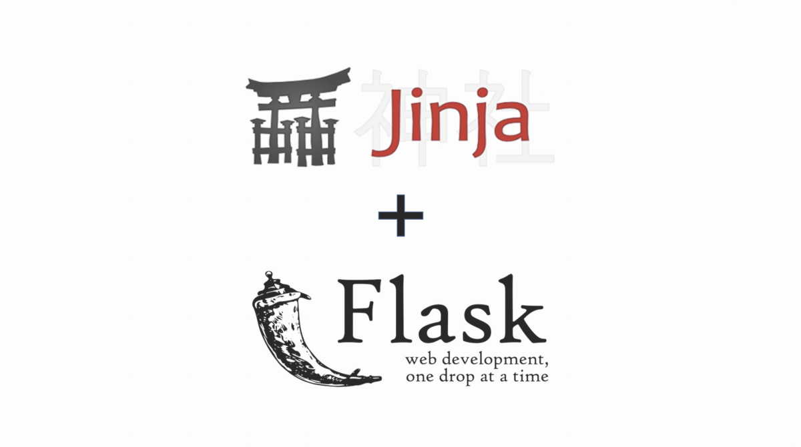

# Hands-on Flask-02 : Basic usage of Jinja Templates

Purpose of the this hands-on training is to give the students quick introductory knowledge of how to create a Flask web application on local.

## Learning Outcomes.

At the end of the this hands-on training, students will be able to;

- understand client-server software architecture.

- get familiar with Python Flask framework.

- install Python and Flask framework on local

- build a simple web application with Python Flask framework.

- use git repo to manage the application versioning.

- run the web application on AWS EC2 instance using the GitHub repo as codebase (will be shown by instructor).

## Outline

- Part 1 - Write a Simple Hello World Web Application with Jinja template on GitHub Repo

- Part 2 - Install Python and Flask framework on Amazon Linux 2 EC2 Instance

## Part 1 - Write a Simple Hello World Web Application with Jinja template on GitHub Repo

- Create folder named `flask-02-Jinja_Template` within your repo under `python/hands-on` and go under it

- Create python file named `jinja.py`

- Import Flask and render_template modules.

- Create an object named `app` from imported Flask module.

- Create an `index.html` file under templates folder.

- Create a function named `head` which sends number `number1` and `number2` variables to the `index.html`. Use these variables into the `index.html` file. Assign a URL route the `head` function with decorator `@app.route('/')`.

- Create an `body.html` file under templates folder.

- Create a function named `number` which sends number `num1` and `num2` and sum of them to the `index.html`. Use these variables into the `body.html` file. Assign a URL route the `number` function with decorator `@app.route('/sum')`.

- run the application in debug mode

- Connect the Hello World application from the web browser with `localhost:5000` or `127.0.0.1:5000`

- Save the complete code as `jinja.py` file under `flask-02-Jinja_Template` folder.

- Add and commit all changes on local repo

- Push all files to your remote repo on GitHub.

## Part 2 - Run the Hello World App on EC2 Instance

- Launch an Amazon EC2 instance using the Amazon Linux 2 AMI with security group allowing SSH (Port 22) and HTTP (Port 80) connections.

- Connect to your instance with SSH.

- Update the installed packages and package cache on your instance.

- install git and wget

- Download the web application file from GitHub repo.

- Run the web application

- Connect the Hello World application from the web browser

- Connect the Hello World application from the terminal with `curl` command.
